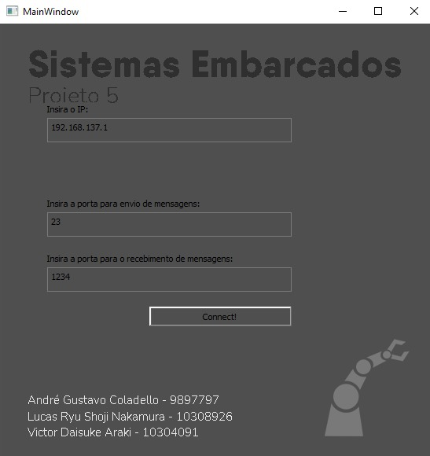
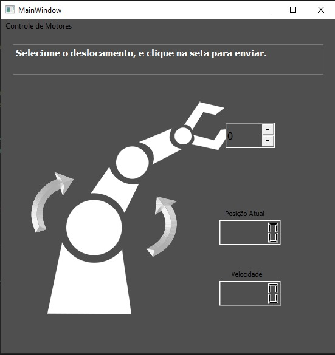
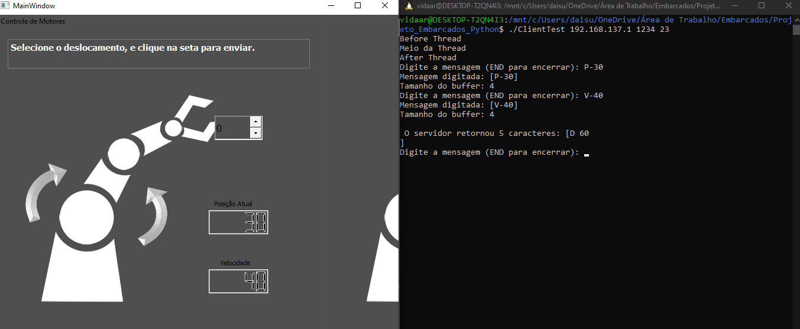
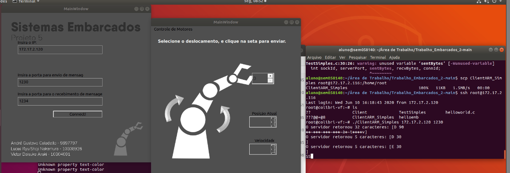

# Trabalho_Embarcados

Repositório do projeto de Sistemas embarcados - Primeiro semestre de 2021.  
<b> Projeto 5: IHM para braço robótico de reabilitação. </b>

 
André Gustavo Espinhosa Coladello - 9897797
 
Lucas Ryu Shoji Nakamura - 10308926
 
Victor Daisuke Araki - 10309041
 
 
  

<h1> 1. CONSIDERAÇÕES INICIAIS </h1>  
  
 1.1 Para compilar os códigos é necessário a instalação de todas as bibliotecas:  
          stdio.h (Client.c)  
          stdlib.h (Client.c)  
          string.h (Client.c)  
          sys/types.h (Client.c)  
          sys/socket.h (Client.c)  
          netinet/in.h (Client.c)  
          unistd.h (Client.c)  
          netdb.h (Client.c)  
          unistd.h (Client.c)  
          pthread.h (Client.c)  
          pyqt5 (mainwindow.py)  
   
 1.2 No caso de uso do Linux, o compilador de C/C++ já possui as bibliotecas necessárias para o "Client.c";  
   
 1.3 No caso de uso do Linux, para se compilar o arquivo em C/C++ usar a linha: "gcc -Wall Client.c -pthread -o Client";  
   
 1.4 Para o download da biblioteca referente a Python, usar o comando "pip install pyqt5";  

<h1> 2. PROJETO </h1>
  
 2.1 Inicialmente foi usado os arquivos contidos na pasta "Projeto_Embarcados". Nela usou-se o arquivo "initial.connect.ui" como base.  
  
 2.2 Devido a afinidade dos alunos com Python, converteu-se o arquivo inicial em ".py", fazendo uso da "pyuic5 xyz.ui > xyz.py". Para tal é necessário a instalação do pacote "pyqt5-dev-tools".  
  
 2.3 Para o desenvolvimento do projeto, usou-se os códigos de teste contidos na pasta "Projeto_Embarcados_Python".
  
 2.4 A escrita do código do cliente foi feita em linguagem C, para a posterior transferencia para o sistema Embarcado.
  
 2.5 Os códigos finais estão contidos na pasta "Projeto_Embarcados_Final".
  
 2.6 Primeiramente o projeto foi desenvolvido sem a possibilidade de teste no sistema embarcado. Dessa forma, os códigos foram sintetizados anteriormente, interface gráfica por meio do software de desenvolvimeno Qt e restante em Visual Studio Code, e testados.
  

<h1> 3. SIMULAÇÕES </h1> 
  
 3.1 Servidor;
  <figure>
      
 
 Figura 3.1 - Print da Interface do Servidor (menu principal de definição) </figcaption>
    </figure>
    
    
 Esse menu serve para definir as conexões, como: o IP da máquina que será o host, a porta dentro da qual será usada para o envio de mensagem e aquela para recebimento de mensagens. Dessa forma o codigo pode ser usado em diferentes máquinas.
   
  <figure>
      
 
 Figura 3.2 - Print da Interface do Servidor (monitorando mensagens) </figcaption>
    </figure>
    
    Esse visor apresenta o menu de usuário para envio das mensagens do robô.

  
 3.2 Cliente;  
      O cliente foi escrito em linguagem C com o intuito de permitir a inclusão do código já compilado na placa. Os testes primários foram feitos nos computadores pessoais com portas locais.
  
    <figure>
      
 
 Figura 3.3 - Print do prompt recebendo e enviando mensagem no Windows </figcaption>
      </figure>

  
 3.3 Em sistema embarcado (VIOLA);   
      A tranferência dos códigos se deram fazendo uso dos passos expostos na "aula 04: roteiro_lab_MK". Iniciamente testou-se a conexão com placa, transferindo o código modelo de CLIENTE, a fim de anular erros provenientes do código escrito.

    <figure>
      
 
 Figura 3.4 - Resultado teste em sistema embarcado do código modelo </figcaption>
      </figure>

      
 Para tal implementação, geravou-se o vídeo "TesteComThreadSimples.mp4", contido na pasta "Vídeos". Agora, tal transferência também se deu com nosso código de CLIENTE.

   <figure>
      
 
 Figura 3.5 - Resultado do teste em sistema embarcado de nosso código </figcaption>
      </figure>
      
      
 Para tal implementação, gravou-se o vídeo "MultiThread.mp4", contido na pasta "Vídeos".

<h1> 4. COMUNICAÇÃO CAN </h1>  
  
 4.1 A transmissão CAN está fora do escopo do projeto;  
  
 4.2 A rede CAN trabalha com diferenças de potenciais, não com valor nominais de tensões;   
  
 4.3 A mensagem padrão CAN possui 59 bits, com 11 bits de identificação iniciais, com os seguintes tipos: Data, Remote, Overload e Error Frames;   
  
 4.4 Para a transmissão é necessária apenas um fio, dessa forma um barramento com dois fios, ainda são funcionais caso um apresente falha no link;   

